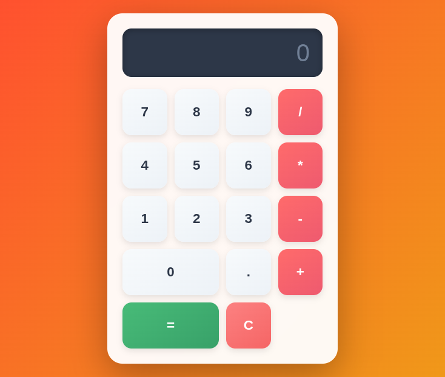

# 🧮 Modern Calculator

A beautiful, responsive calculator built with vanilla HTML, CSS, and JavaScript. Features a modern glassmorphism design with smooth animations and full keyboard support.



## ✨ Features

- ➕ **Basic Operations**: Addition, subtraction, multiplication, and division
- 🎨 **Modern UI**: Glassmorphism design with gradient backgrounds
- ⌨️ **Keyboard Support**: Full keyboard input support for faster calculations
- 📱 **Responsive**: Works perfectly on desktop, tablet, and mobile devices
- 🎯 **Decimal Support**: Handle decimal numbers with precision
- 🛡️ **Error Handling**: Division by zero protection
- ✨ **Smooth Animations**: Hover effects and transitions for better UX

## 🚀 Demo

Check out the live demo: [https://yourusername.github.io/calculator](https://yourusername.github.io/calculator)

## 🎮 How to Use

### Mouse Input
- Click on number buttons to enter digits
- Click on operator buttons (+, -, *, /) to perform operations
- Click `=` to calculate the result
- Click `C` to clear and start over

### Keyboard Input
- **Numbers**: Type 0-9 and . (decimal point)
- **Operators**: Type +, -, *, /
- **Calculate**: Press `Enter` or `=`
- **Clear**: Press `Escape` or `C`
- **Delete**: Press `Backspace` to remove last digit

## 🛠️ Technologies Used

- HTML5
- CSS3 (Grid, Flexbox, Gradients, Animations)
- Vanilla JavaScript (ES6+)

## 📦 Installation

1. Clone the repository:
```bash
git clone https://github.com/yourusername/calculator.git
```

2. Navigate to the project folder:
```bash
cd calculator
```

3. Open `index.html` in your browser or use a local server:
```bash
# Using Python
python -m http.server 8000

# Using Node.js
npx serve
```

4. Visit `http://localhost:8000` in your browser

## 🎨 Customization

Want to change the colors? Edit these CSS variables in the `<style>` section:

```css
/* Background gradient */
background: linear-gradient(135deg, #667eea 0%, #764ba2 100%);

/* Operator button colors */
background: linear-gradient(145deg, #4299e1, #3182ce);

/* Display background */
background: #2d3748;
```

Check out the [Color Palette Ideas](#color-palette-ideas) section below for inspiration!

## 🎨 Color Palette Ideas

### Ocean Theme 🌊
- Background: `linear-gradient(135deg, #2E3192 0%, #1BFFFF 100%)`
- Operators: `linear-gradient(145deg, #00d2ff, #3a7bd5)`

### Sunset Fire 🔥
- Background: `linear-gradient(135deg, #FF512F 0%, #F09819 100%)`
- Operators: `linear-gradient(145deg, #ff6b6b, #ee5a6f)`

### Dark Mode 🌙
- Background: `linear-gradient(135deg, #1e1e1e 0%, #2d2d2d 100%)`
- Operators: `linear-gradient(145deg, #bb86fc, #9965f4)`

## 📸 Taking a Screenshot

To add your own screenshot:

1. Open the calculator in your browser
2. Take a screenshot (Windows: `Win + Shift + S`, Mac: `Cmd + Shift + 4`)
3. Save it as `screenshot.png` in your project folder
4. Commit and push:
```bash
git add screenshot.png
git commit -m "Added screenshot"
git push
```

## 🤝 Contributing

Contributions are welcome! Feel free to:
- Report bugs
- Suggest new features
- Submit pull requests

## 📝 License

This project is open source and available under the [MIT License](LICENSE).

## 👨‍💻 Author

**Your Name**
- GitHub: [@yourusername](https://github.com/yourusername)
- Email: your.email@example.com

## 🙏 Acknowledgments

- Inspired by modern calculator designs
- Built as a learning project for web development fundamentals

---

⭐ **If you found this helpful, please give it a star!** ⭐

Made with ❤️ and ☕